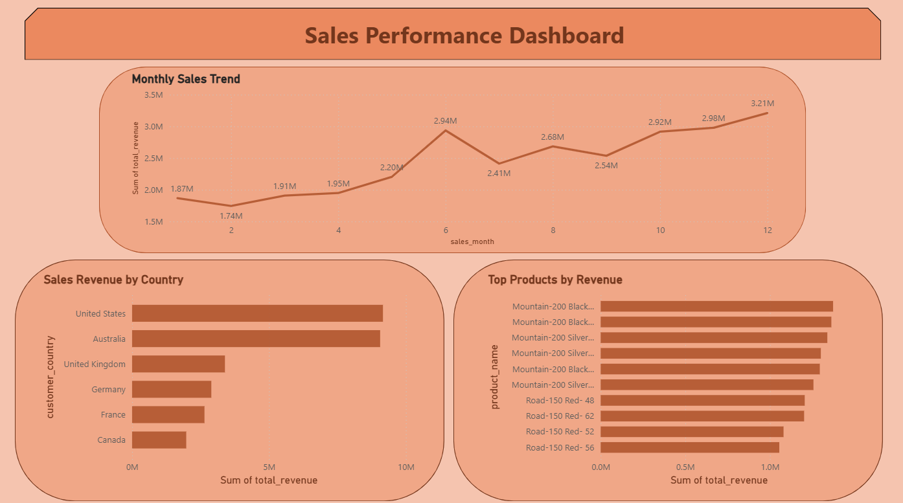
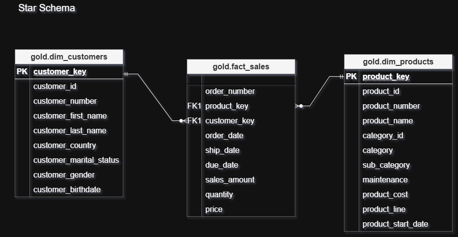

# 🏗️ SQL Data Warehouse – Sales Analytics

A modern SQL-based data warehouse built with SQL Server,
implementing a Bronze → Silver → Gold pipeline architecture
for end-to-end sales analytics.

---

## 📌 Project Overview

This project demonstrates the design and implementation of a modern SQL-based Data Warehouse for sales analytics. It integrates data from two source systems (CRM and ERP), processes it through a multi-layer transformation pipeline, and delivers clean analytical datasets for business reporting.

---

## 🏛️ Architecture

The warehouse follows a three-layer medallion architecture:


---

## 📊 Dashboard Preview

- The Power BI dashboard connects to the **Gold layer views** of the data warehouse,
which provide business-ready data modeled using a star schema.
- It visualizes key sales insights such as revenue trends, top customers,
and product performance.



---

## 📂 Project Structure

```
sql_warehouse_learning/
│
├── datasets/                         # Raw source datasets used for the data warehouse
│   ├── source_crm/                   # CRM (Customer Relationship Management) source data
│   │   ├── cust_info.csv            
│   │   ├── prd_info.csv              
│   │   └── sales_details.csv        
│   │
│   └── source_erp/                   # ERP (Enterprise Resource Planning) source data
│       ├── CUST_AZ12.csv            
│       ├── LOC_A101.csv             
│       └── PX_CAT_G1V2.csv          
│
├── scripts/                          # SQL scripts used to build and run the data warehouse pipeline
│   ├── init.database.sql             # Initialize the database and create base schemas
│   │
│   ├── bronze/                       # Bronze layer: raw data ingestion layer
│   │   ├── ddl_bronze.sql            # Create Bronze tables to store raw source data
│   │   └── proc_load_bronze.sql      # Load CSV files into Bronze tables
│   │
│   ├── silver/                       # Silver layer: cleaned and standardized data
│   │   ├── ddl_silver.sql            # Create structured tables for cleaned data
│   │   └── proc_load_silver.sql      # Transform Bronze data into cleaned Silver tables
│   │
│   └── gold/                         # Gold layer: analytics-ready business layer
│       ├── ddl_gold.sql              # Create dimension and fact views for the star schema
│       └── reporting_views.sql       # Additional reporting views for business analysis
│
├── queries/                          # Analytical SQL queries used to answer business questions
│   ├── basic_sales_metrics.sql     
│   ├── customer_analysis.sql      
│   ├── product_analysis.sql         
│   ├── time_analysis.sql           
│   └── functions.sql                
│
├── tests/                            # Data quality and validation tests
│   ├── check_silver.sql              # Validate cleaned data in the Silver layer
│   ├── check_gold.sql                # Validate analytics-ready data in the Gold layer
│                
│
└── docs/                             # Project documentation, diagrams, and dashboard files
    │
    ├── dashboard/                    # Power BI dashboard files and preview images
    │   ├── sales_dashboard.pbix    
    │   └── sales_dashboard_preview.png 
    │
    ├── data_warehouse.png            # High-level architecture of the data warehouse system
    ├── dataflow.png                  # Detailed ETL data flow from source systems to warehouse layers
    ├── integration_model.png         # Diagram showing integration of CRM and ERP datasets
    ├── star_schema.png               # Star schema design used in the Gold layer
    └── business_questions.md         # Business questions answered using SQL analysis
```

---

## 📊 Data Sources

### CRM System (`datasets/source_crm/`)
| File | Description |
|---|---|
| `cust_info.csv` | Customer master data |
| `prd_info.csv` | Product catalog |
| `sales_details.csv` | Sales transactions |

### ERP System (`datasets/source_erp/`)
| File | Description |
|---|---|
| `CUST_AZ12.csv` | ERP customer records |
| `LOC_A101.csv` | Location / geography data |
| `PX_CAT_G1V2.csv` | Product category mappings |

---

## 🌟 Data Model (Star Schema)

The Gold layer is modeled as a **Star Schema** for optimized analytical querying:




| Table | Type | Description |
|---|---|---|
| `fact_sales` | Fact | Core sales transactions |
| `dim_customers` | Dimension | Customer attributes |
| `dim_products` | Dimension | Product attributes |

---

## 📈 Analytics Queries

Pre-built queries covering four analytical domains:

**Sales Metrics** (`basic_sales_metrics.sql`)
- Total revenue and order counts
- Average order value
- Sales trends over time

**Customer Analysis** (`customer_analysis.sql`)
- Top customers by revenue
- Purchase frequency and behavior
- Customer segmentation

**Product Analysis** (`product_analysis.sql`)
- Best-selling products
- Revenue contribution by category
- Product performance rankings

**Time Analysis** (`time_analysis.sql`)
- Monthly and quarterly trends
- Seasonal sales patterns
- Year-over-year comparisons

**Advanced Analytics** (`functions.sql`)
- Advanced analytical queries using SQL window functions
- Includes ranking, running totals, revenue share analysis
- Top-customer analysis across different dimensions
  
---

## 🚀 How to Run

Follow these steps in order:

```bash
# 1. Initialize the database and create base schemas
scripts/init.database.sql

# 2. Create Bronze layer tables for raw source data
scripts/bronze/ddl_bronze.sql

# 3. Load raw data into Bronze layer (after execute the file. execute 'EXEC bronze.load_bronze' next)
scripts/bronze/proc_load_bronze.sql

# 4. Create structured tables for the Silver layer
scripts/silver/ddl_silver.sql

# 5. Clean and transform data into the Silver layer (after execute the file. execute 'EXEC silver.load_silver' next)
scripts/silver/proc_load_silver.sql

# 6. Build the Gold analytics layer (fact and dimension views)
scripts/gold/ddl_gold.sql

# 7. Create reporting and business analysis views
scripts/gold/reporting_views.sql
```

After setup, run queries from the `queries/` directory or connect Power BI to the Gold layer views.

---

## ✅ Data Quality Testing

Tests are located in the `tests/` directory:

| Test File | Scope |
|---|---|
| `check_silver.sql` | Validates cleaning, type consistency, null checks |
| `check_gold.sql` | Validates star schema integrity and business logic |

---

## 🛠️ Technologies Used

- **SQL Server** – Database engine for the data warehouse
- **SQL Server Management Studio (SSMS 22)** – SQL development environment
- **T-SQL** – Data transformation, data modeling, and analytical queries
- **Power BI** – Dashboard and reporting
- **draw.io** – Data warehouse architecture and modeling diagrams
- **Medallion Architecture** – Bronze / Silver / Gold data pipeline design
- **Star Schema** – Dimensional modeling for the analytics layer

---

## 🔮 Future Improvements

- [ ] Automated ETL scheduling (SQL Server Agent / Azure Data Factory)
- [ ] Expanded analytical datasets (returns, inventory, forecasting)
- [ ] Embedded Power BI dashboards
- [ ] Data quality monitoring and alerting
- [ ] Incremental load support for large datasets

---

## 💡 Key Skills Demonstrated

| Area | Detail |
|-----|------|
| Data Warehouse Design | Medallion architecture, Bronze / Silver / Gold layer separation |
| ETL Development | Data ingestion and transformation using SQL scripts |
| Data Modeling | Star schema with fact and dimension views |
| SQL Transformation | Data cleaning, deduplication, and standardization |
| Analytical Querying | Metrics calculation, ranking, and trend analysis |
| Data Quality | Validation queries for Silver and Gold layers |
