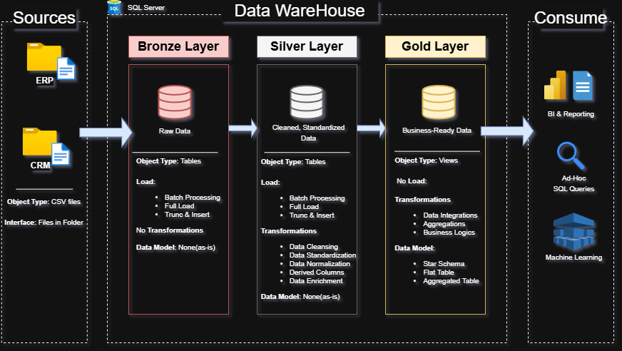

# Sales Data Warehouse & Analytics Project
This project demonstrates the design and implementation of a SQL-based Data Warehouse for sales analytics.

Data from multiple systems (CRM and ERP) is ingested, cleaned, and transformed using a Bronze → Silver → Gold data architecture.
The final analytical dataset is used to perform business analysis with SQL and visualization in Power BI.

The goal of this project is to simulate a real-world data pipeline, including data ingestion, transformation, data modeling, and reporting.

## Objectives

The objectives of this project are:
- Integrate data from multiple source systems
- Build a structured data warehouse architecture
- Transform raw data into clean analytical datasets
- Design a Star Schema for analytics
- Perform business analysis using SQL
- Create a Power BI dashboard for insights

## Data Architecture
The data warehouse is built using a Medallion Layers:
### Bronze Layer
- Raw data ingestion from source systems
### Silver Layer
- Data cleaning and transformation
- Standardization and validation
### Gold Layer
- Analytical data model
- Star schema for reporting
#### Pipeline flow:
Source Systems → Bronze → Silver → Gold → Power BI Dashboard

